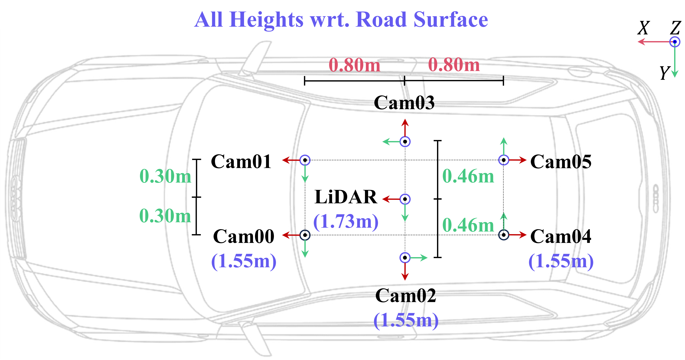

Data Collection
===============

Overview
--------
The ``data_collection/`` package runs a synchronous CARLA session that spawns an ego vehicle, configurable traffic, and a sensor rig, and then records multi-modal data to disk. 
The package has been tested on **Windows 11, CARLA 0.10.0, Unreal Engine 5**. 

Prerequisites
-------------

- `CARLA UE5 server <https://carla-ue5.readthedocs.io/en/latest/#getting-started>`_: Please follow the official instructions to build and run the server. 
- Python 3.8 for CARLA environment.

Sensor configuration
--------------------
- The setup of cameras **cam00** -- **cam03** follows a KITTI-360-style rig. To facilitate surround-view perception research, we additionally provide two rear-view cameras: **cam04** and **cam05**, which are mirror-symmetric to **cam00** and **cam01** around the LiDAR.

- Each camera collects **rgb**, **semantic**, and **depth** images with a resolution of 376x1408 pixels.

- LiDAR and semantic LiDAR data are collected with a 32-channel sensor, a range of 120 meters, spinning at 10 Hz and producing 250,000 points per second.

A detailed figure of the sensor configuration is shown below:

Running
-------

Use the following command to launch the data collection session:

.. code-block:: bash

   cd data_collection/
   python main.py

Hydra loads ``config/config.yaml`` by default. Override on the command line as needed, for example:

.. code-block:: bash

   python main.py data_collection.frames=100

Output Data Format
------------------
The collected data is saved in the following directory structure:

.. code-block:: text

   CarlaOccV1
   └── <TownXX_Opt>_Seq<YY>/
       ├── rgb/
       │   ├── image_00/      # Cam00 RGB images
       │   ├── image_01/      # Cam01 RGB images
       │   ├── ...
       │   └── image_bev/     # BEV RGB images
       ├── semantics_carla/
       │   ├── image_00/      # Cam00 semantic images in CityScapes palette
       │   ├── ...
       ├── depth_carla/
       │   ├── image_00/      # Cam00 depth maps
       │   ├── ...
       ├── lidar/
       │   └── *.ply          # LiDAR point clouds (x, y, z, intensity)
       ├── semantic_lidar/
       │   └── *.ply          # Semantic LiDAR (x, y, z, CosAngle, ObjIdx, ObjTag)
       ├── traffic_info/
       │   └── *.yaml         # Traffic participant information per frame
       └── poses/
           ├── cam_00.txt     # Cam00 poses
           └── lidar.txt      # LiDAR poses

